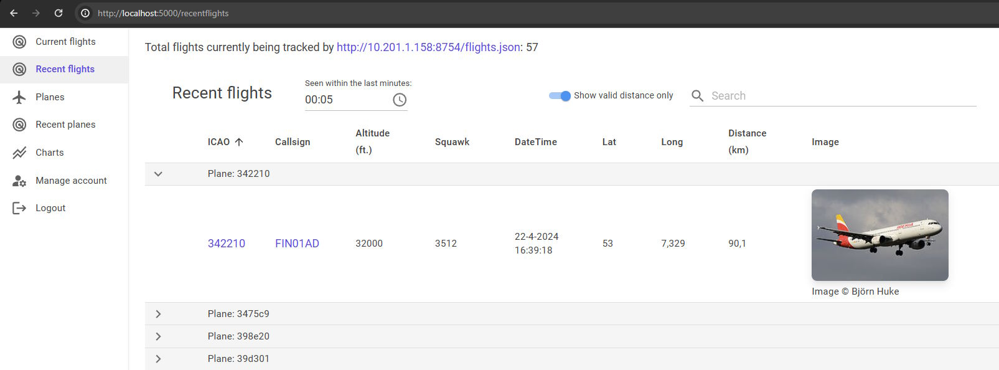

# AdsbDashboard

.NET 8 Blazor project that parses, saves and displays ADS-B messages exposed by the hostname:8754/flights.json endpoint of a [FlightRadar24 feeder.](https://www.flightradar24.com/share-your-data).

The blazor website has several pages for data visualization, containing sortable/filterable/paginated tables.

[MudBlazor](https://mudblazor.com/) UI components are used. Default ASP.NET Identity is used for user management.

Photos of persisted airplanes are fetched from the [Planespotters API](https://www.planespotters.net/photo/api).

A background worker service scrapes the FR24feed tracked.json endpoint at a configurable interval and persists any new information to the database. Planes with unique ICAO registration codes are persisted, as well as any unique 'flight messages'.

A flight message is a position report containing the following info (some are optional):

- Registration
- Callsign
- Altitude
- Squawk
- Lat & Lon
- Groundspeed

Please note that this project is not affiliated with FlightRadar24 in any way.

